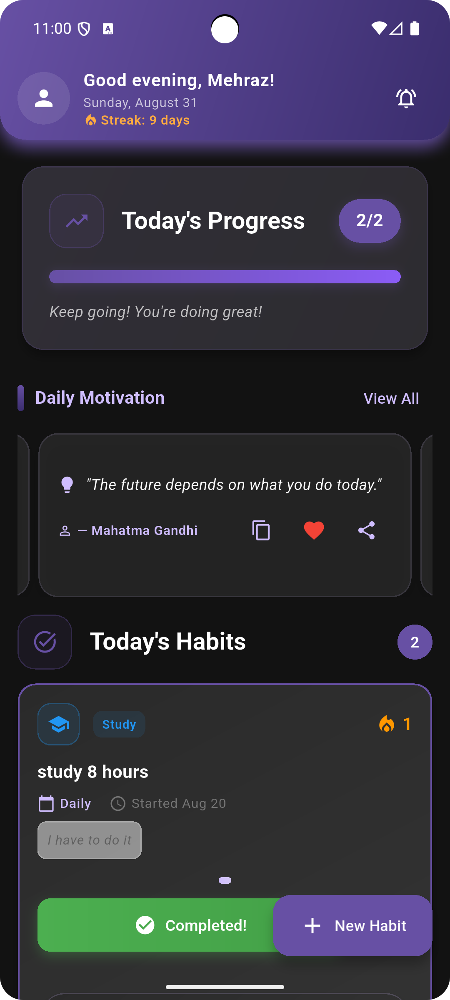
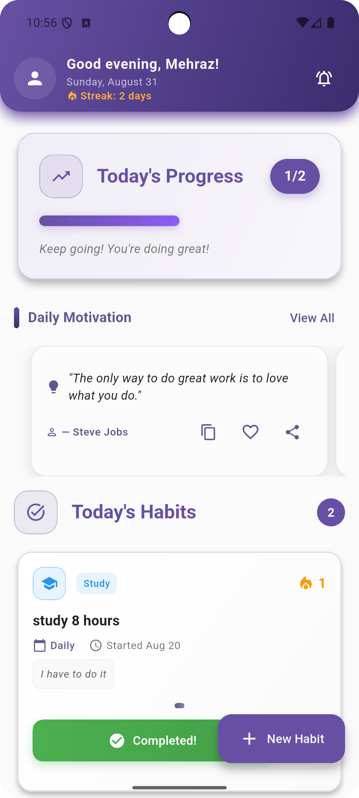
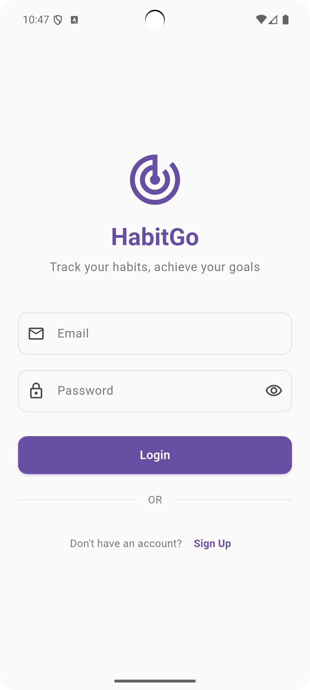
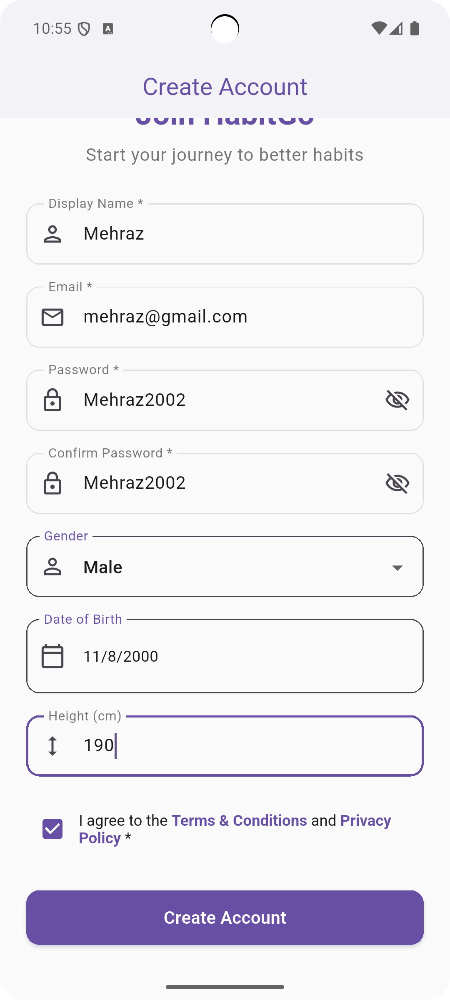
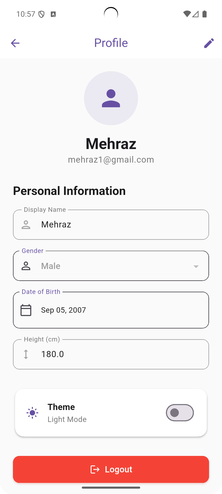
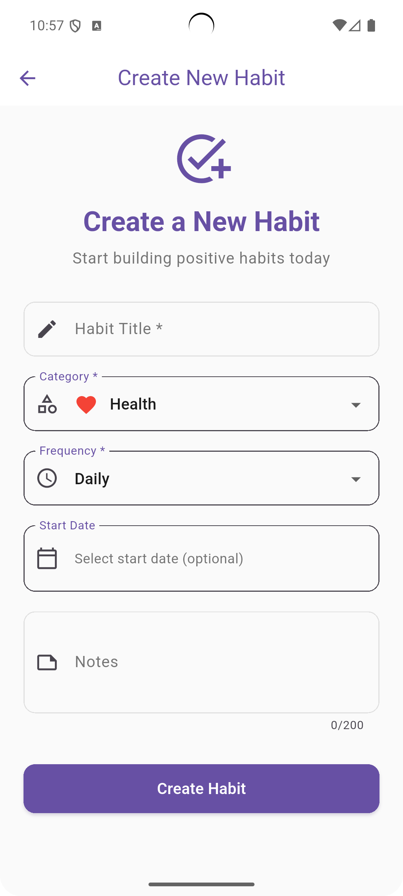
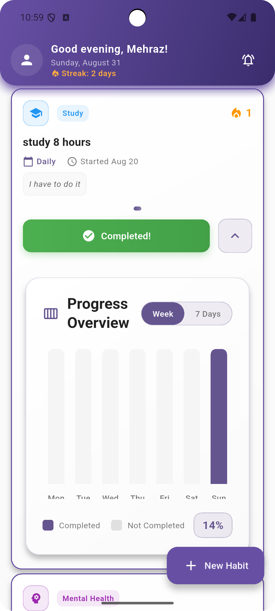
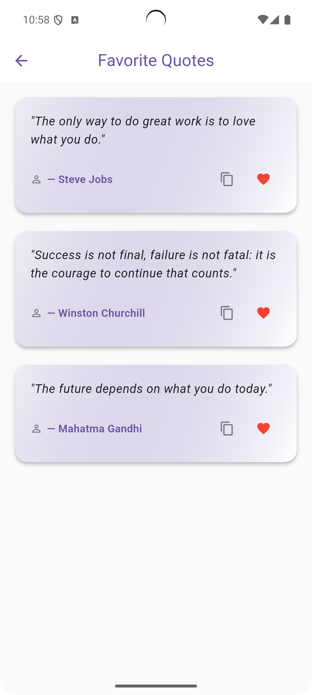
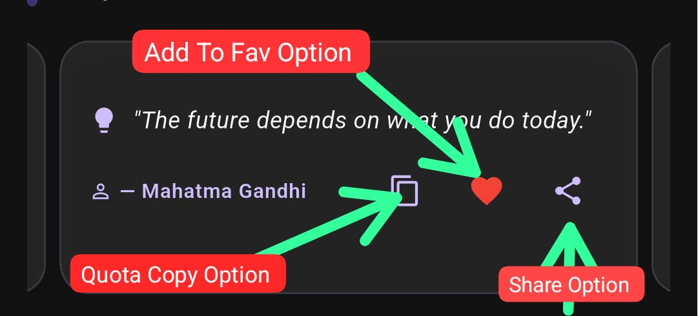

# 🚀 HabitGo - Smart Habit Tracking App

[](https://flutter.dev/)
[](https://dart.dev/)
[](https://firebase.google.com/)
[](https://flutter.dev/multi-platform)

A beautiful, cross-platform habit tracking application built with Flutter that helps users build positive habits, track progress, and stay motivated with inspirational quotes.

## 📱 Screenshots

### 🎨 User Interface & Design

<div align="center">
  <table>
    <tr>
      <td align="center">
        
        <br><strong>Header UI Design</strong>
      </td>
      <td align="center">
        
        <br><strong>Dark Mode Theme</strong>
      </td>
      <td align="center">
        
        <br><strong>Home Dashboard</strong>
      </td>
    </tr>
  </table>
</div>

### 🔐 Authentication & Profile

<div align="center">
  <table>
    <tr>
      <td align="center">
        
        <br><strong>Login Screen</strong>
      </td>
      <td align="center">
        
        <br><strong>Registration Screen</strong>
      </td>
      <td align="center">
        
        <br><strong>Profile Section</strong>
      </td>
    </tr>
  </table>
</div>

### 📊 Habit Management & Progress

<div align="center">
  <table>
    <tr>
      <td align="center">
        
        <br><strong>Add New Habit</strong>
      </td>
      <td align="center">
        
        <br><strong>Habit Progress</strong>
      </td>
      <td align="center">
        
        <br><strong>Habit Suggestions</strong>
      </td>
    </tr>
  </table>
</div>

### 💬 Motivation & Features

<div align="center">
  <table>
    <tr>
      <td align="center">
        
        <br><strong>Favorite Quotes</strong>
      </td>
      <td align="center">
        
        <br><strong>Motivation Features</strong>
      </td>
      <td align="center">
        
        <br><strong>Modern UI</strong>
      </td>
    </tr>
  </table>
</div>

### 🔒 Security & Backend

<div align="center">
  <table>
    <tr>
      <td align="center">
        
        <br><strong>Firebase Database Rules</strong>
      </td>
      <td align="center">
        
        <br><strong>Data Security</strong>
      </td>
      <td align="center">
        
        <br><strong>Backend Integration</strong>
      </td>
    </tr>
  </table>
</div>

## ✨ Features

### 🔐 **Authentication System**

- Secure user registration and login
- Firebase Authentication integration
- User profile management
- Password recovery support

### 📝 **Habit Management**

- Create and customize habits
- Set frequency and reminders
- Track daily progress
- Habit categories and tags
- Smart habit suggestions

### 📊 **Progress Tracking**

- Visual progress charts
- Streak counting
- Weekly/monthly statistics
- Achievement badges
- Progress history

### 💬 **Motivation System**

- Daily inspirational quotes
- Favorite quotes collection
- Motivational notifications
- Progress celebrations

### 🎨 **User Experience**

- Beautiful, modern UI design
- Dark/Light theme support
- Responsive design for all screen sizes
- Smooth animations and transitions
- Intuitive navigation

### 🌐 **Cross-Platform Support**

- **Android** - Native Android app
- **iOS** - Native iOS app
- **Web** - Progressive Web App (PWA)
- **macOS** - Desktop application
- **Linux** - Linux desktop app
- **Windows** - Windows desktop app

## 🔥 Firebase Configuration

### **Backend Services**

- **Firebase Authentication** - Secure user login and registration
- **Cloud Firestore** - Real-time NoSQL database for user data
- **Firebase Storage** - File storage for user uploads and media
- **Firebase Core** - Cross-platform app initialization

### **Security Implementation**

- **User Data Isolation** - Users can only access their own data
- **Authentication Required** - All database operations require valid user login
- **Structured Collections** - Organized data hierarchy (users → habits → quotes)
- **Real-time Security** - Security rules enforced on every database operation
- **Firestore Rules** - Custom security rules protecting user data (see screenshot above)

### **Data Architecture**

```
users/{userId}/
├── profile/          # User profile information
├── habits/{habitId}/ # User's personal habits
└── favorites/
    └── quotes/{quoteId}/ # User's favorite quotes
```

### **Setup Instructions**

1. **Create Firebase Project** - Set up new project in Firebase Console
2. **Enable Services** - Activate Authentication, Firestore, and Storage
3. **Configure Security** - Implement Firestore security rules
4. **Add Configuration** - Update `firebase_options.dart` with your project details
5. **Test Integration** - Verify authentication and database operations

⚠️ **Security Note**: Never commit actual Firebase API keys to public repositories. Use environment variables and keep sensitive configuration private.

## 🏗️ Project Structure

```
habitgo/
├── 📁 lib/                          # Main application code
│   ├── 📁 config/                   # Configuration files
│   ├── 📁 models/                   # Data models
│   ├── 📁 providers/                # State management
│   ├── 📁 screens/                  # UI screens
│   ├── 📁 services/                 # Business logic services
│   └── 📁 widgets/                  # Reusable UI components
├── 📁 android/                      # Android platform files
├── 📁 ios/                          # iOS platform files
├── 📁 web/                          # Web platform files
├── 📁 macos/                        # macOS platform files
├── 📁 linux/                        # Linux platform files
├── 📁 windows/                      # Windows platform files
├── 📁 assets/                       # App assets
└── 📁 ScreenShot/                   # App screenshots
```

## 🔄 Workflow

### 1. **User Onboarding**

```
Registration → Login → Profile Setup → Welcome Tutorial
```

### 2. **Habit Creation & Management**

```
Create Habit → Set Frequency → Add Reminders → Start Tracking
```

### 3. **Daily Usage Flow**

```
Open App → View Dashboard → Check Habits → Mark Progress → View Statistics
```

### 4. **Progress Tracking**

```
Daily Check-ins → Streak Counting → Weekly Reports → Monthly Analytics
```

## 🚀 Getting Started

### Prerequisites

- [Flutter SDK](https://flutter.dev/docs/get-started/install) (3.16.0 or higher)
- [Dart SDK](https://dart.dev/get-dart) (3.2.0 or higher)
- [Firebase Account](https://firebase.google.com/) (for backend services)

### Installation

1. **Clone the repository**

   ```bash
   git clone https://github.com/itz-mehraz/Habit_GO.git
   cd Habit_GO
   ```

2. **Install dependencies**

   ```bash
   flutter pub get
   ```

3. **Configure Firebase**

   - Follow the [Firebase Setup Guide](FIREBASE_SETUP_GUIDE.md)
   - Add your Firebase configuration files

4. **Run the app**
   ```bash
   flutter run
   ```

## 🛠️ Build & Deploy

### Build for Production

```bash
# Android APK
flutter build apk --release

# Web
flutter build web --release

# iOS
flutter build ios --release
```

## 🧪 Testing

```bash
# Run all tests
flutter test

# Run tests with coverage
flutter test --coverage
```

## 🤝 Contributing

We welcome contributions! Please follow these steps:

1. Fork the repository
2. Create a feature branch (`git checkout -b feature/AmazingFeature`)
3. Commit your changes (`git commit -m 'Add some AmazingFeature'`)
4. Push to the branch (`git push origin feature/AmazingFeature`)
5. Open a Pull Request

## 📄 License

This project is licensed under the MIT License.

## 📞 Support

- **Issues**: [GitHub Issues](https://github.com/itz-mehraz/Habit_GO/issues)
- **Discussions**: [GitHub Discussions](https://github.com/itz-mehraz/Habit_GO/discussions)

---

<div align="center">
  <p>Made with ❤️ using Flutter</p>
  <p>If you find this project helpful, please give it a ⭐</p>
  
  <br>
  
  <a href="https://github.com/itz-mehraz" target="_blank">
    
  </a>
</div>
